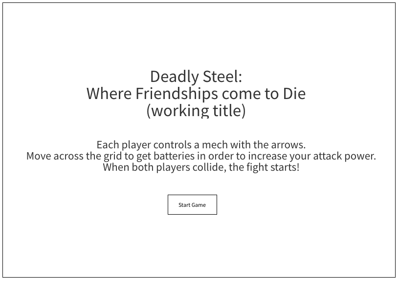
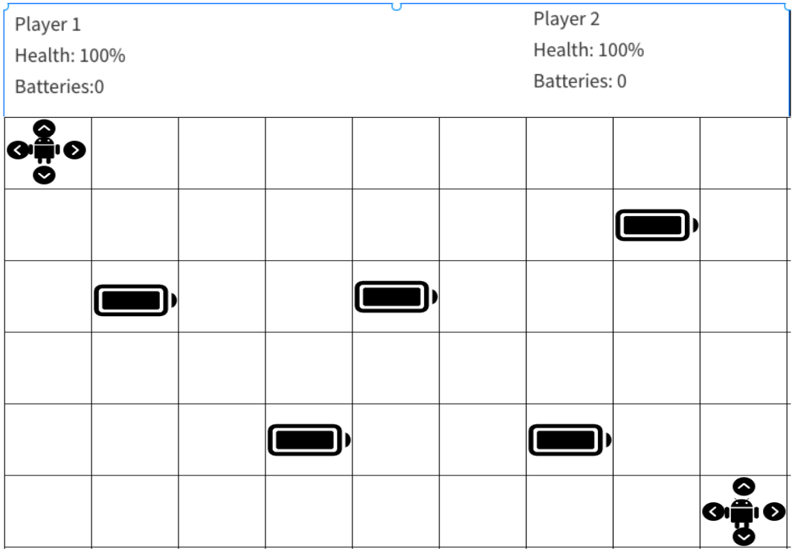
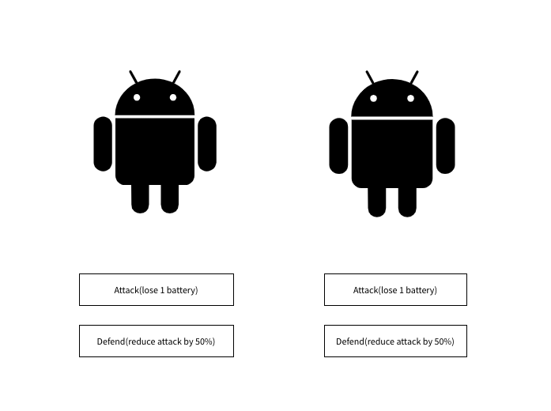
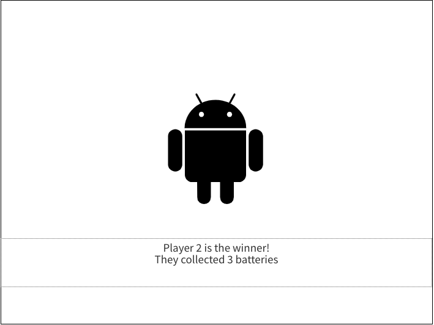

# deadlysteel
A 1v1 robot battling game in which each players moves a robot on a grid in order to collect batteries. Batteries increase the robot's power and allow the robot to do more damage once the two players fight each other. The players fight once they collide on the grid or time runs out!

[Here is a link to the deployed application](https://waltrcodes.github.io/deadlysteel/ "Play Here!")

## Wireframe 

## Schedule (Objectives/Goals)
### Wednesday
1. JS
2. Asset Acquiring

### Thursday
1. HTML/JS
2. Asset Croping 

### Friday
1. JS
2. boardGame function! 

### Saturday
1. HTML/CSS + JS

### Sunday
1. Tweaks and advance HTML/CSS (animations)

### Monday
1. Additional functionality( vs player or vs cpu options, left or right side keyboard functionality if possible)